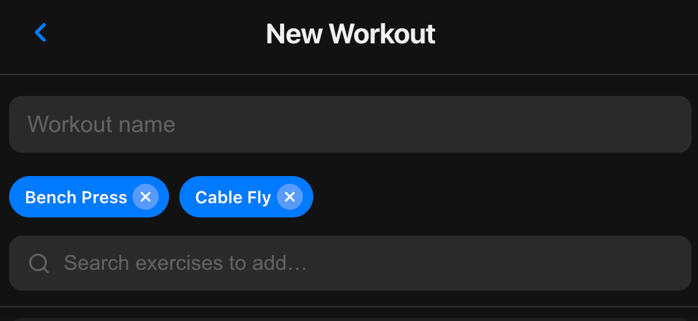

1. [x] Implement "Next Session" Recommendations: The app looks at last session's performance and auto-populates target weight/reps with smart progression rules (increase weight if top of rep range + easy/medium, maintain if hard, +1 rep if working toward max).

2. [x] Volume/Frequency Heatmap: Visual muscle group heatmap showing training frequency over the last 4 weeks, accessible from the History tab.

3. [x] "Previous Best" Reference: Personal record (PR) bar displayed above input fields showing all-time best weight x reps and best session volume.

4. [x] Custom Workout Builder: Exercise database expanded from 15 to 73 exercises across all muscle groups (Chest, Back, Shoulders, Arms, Legs, Core). Existing search and filter functionality works with the expanded list. Existing users automatically get new exercises merged in.

5. [x] Exercise Swapper: During an active workout, users can tap the swap button on any exercise to see biomechanically similar alternatives (e.g., Bench Press -> Dumbbell Press, Incline Press). Swapping preserves any already-logged sets.

6. [x] Export/Import Data: Settings tab with full data backup and restore. Export downloads a JSON file with all exercises, routines, and workouts. Import validates the file structure and replaces current data with confirmation. Also includes storage stats overview and a danger-zone clear-all-data option.

7. [x]  See workout days

Visual Requirements (See reference image in the 7th):

Layout: A horizontal row representing the current week (Sun-Sat).

Day Indicators: Each day is represented by a circular ring containing the day name (e.g., "Mo", "Tu").

Completed Days: Green ring/fill.

Current Day: Highlighted (e.g., Blue fill).

Future/Rest Days: Grey ring.

Status Icons: Below the day circles, display icons:

Scheduled Workout: A standard "Dumbbell" icon.

Completed Workout: A "Dumbbell" icon with a green checkmark badge.

Rest Day: No icon (empty).

Core Logic & State Management:

Default Schedule: The user can define a "Base Schedule" (e.g., Mon, Wed, Fri). The app should pre-populate these days with the "Scheduled Workout" icon.

Completion Logic: When a workout is logged, the day turns Green and gets the checked dumbbell icon.

The "Flexibility" Feature (Crucial):

Rescheduling: Users must be able to tap/drag a scheduled workout from one day to another (e.g., moving Wednesday's lift to Thursday).

Stacking/Early Completion: If a user performs a workout on a non-scheduled day (e.g., doing Friday's workout on Thursday), the system should mark the current day as "Completed" and remove the "Scheduled" icon from the original future day.

Missed Workouts: If a scheduled day passes without completion, it stays Grey (or turns red/alert) and the workout remains "pending" or can be pushed to the next day.

User Interaction Flows:

Long Press: On a scheduled day to enter "Edit Mode" where the workout can be dragged to a different day.

Tap: On a future scheduled day to see details or mark it as "Doing Today."

Technical constraints:

Use [Insert your Tech Stack, e.g., React Native / Flutter / Swift].

Ensure the state updates immediately (optimistic UI) when days are moved.

7.1 [x] Make sure it can reorder workouts to previous days as well, past, not only up to the current day.
7.2 [x] When you click on the workout day, I want to be directed to the workout (routine) this is useful if i go to the gym at 1AM so technically its the next day, but I want to track it as the previous day.
7.3 [x] Whilst using the application with phone i encounter some UX issues. When clicking on the workout its quite easy to make "planned gym day", but when i try to click it again to remove the "planned gym day" its sort of difficult, i have to click not on the day logo but to the side of it to trigger it.
7.4 [x] Lets avoid text under the days for example 1 done or 1 planned to save some space in. the app

8. [x] There is a bug in workout if I perform a set then timer starts running if i dont skip or wait for it to run out, but instead keep clicking on the checkmark button on set, it just creates a lot of sets once the rest times runs out.

9. [x] In addition to history workout logs, if possible I would like to have exercise progress charts 14/30/90 days.

10. [x] Footer of the application ( Routines, History, Exercises, Settings ) when initially opened with Iphone it is slightly hanging above. It is consistent and it alwaysd happens when opening app. I need to drag down the interface so that the footer locks into place.

11. [x] Make the export log name arklog instead of ironlog. Make the exported file datetime with minutes, otherwise i cant export twice a day or more.

12. [x] Make the swap exercise icon more visibly appealing, not it sort of blends in and cant see such functionallity.

13. [x] When I am in workout I would like to see all of exercises at once so I can scroll vertically to see whats waiting for me or look at the previous exercises and reps/sets that I did. Otherwise make it swapable to you can move around the exercises or even both and i can set up custom views. Please consider yourself and determine best approach. 
